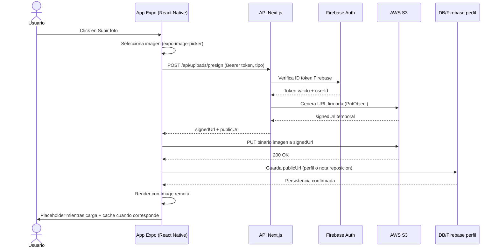

# Flujo de imagenes con AWS S3

Este documento describe el flujo completo desde que el usuario pulsa Subir foto hasta que la imagen se renderiza en la app.

## Objetivo

- No guardar binarios en PostgreSQL ni en Firestore.
- Guardar el archivo en AWS S3.
- Guardar solo la URL publica resultante.
- Mostrar imagen remota con placeholder y cache.

## Diagrama de flujo

## Pasos tecnicos

1. La app solicita una URL firmada al backend con el tipo de uso:
- avatar
- restock

2. El backend valida autenticacion con Firebase y genera una URL firmada para PUT a S3 con expiracion corta.

3. La app sube el archivo directamente a S3 con fetch y Content-Type de imagen.

4. La app guarda la URL publica:
- Perfil: en photoURL del usuario autenticado.
- Reposicion: en el campo imagePlaceholder dentro del metadata de la nota.

5. La UI renderiza la URL remota:
- Placeholder visible mientras no hay URL o mientras carga.
- Cache del recurso de imagen remoto para mejorar UX.

## Endpoints

- Presign:
  - POST /api/uploads/presign
- Upload binario:
  - PUT signedUrl (directo a AWS S3)

## Variables de entorno backend

- AWS_REGION
- AWS_S3_BUCKET
- AWS_ACCESS_KEY_ID
- AWS_SECRET_ACCESS_KEY
- AWS_S3_PUBLIC_BASE_URL (opcional)

## Notas de seguridad

- La signedUrl expira rapidamente.
- Solo usuarios autenticados pueden pedir signedUrl.
- El backend controla prefijos de key por tipo de recurso y usuario.
- El archivo se sube directo a S3: el backend no recibe el binario.
